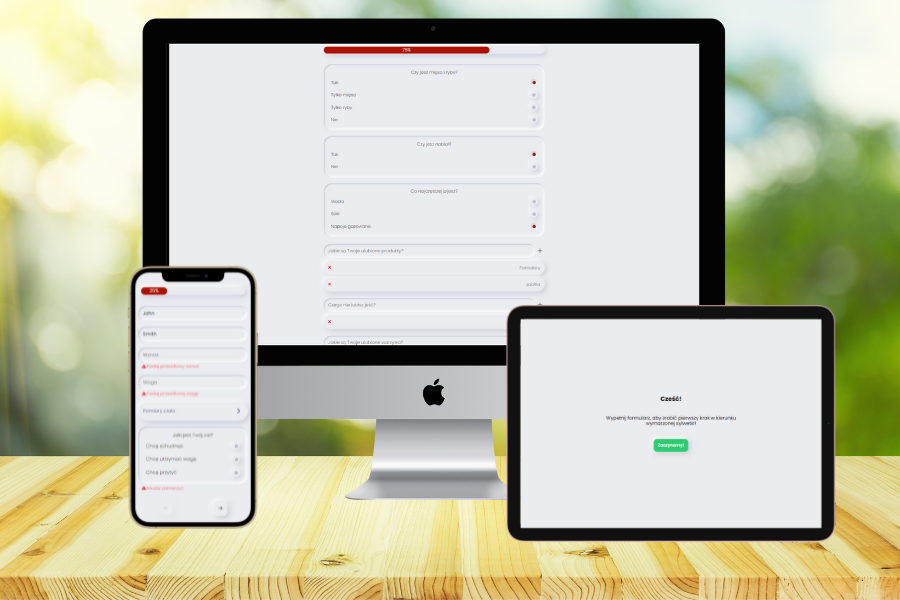

# Diet Form



&nbsp;

## :mag: Overview

:fire: Click to see live version: [Diet Form](https://kubaparol.github.io/diet-form)!

**Diet Form** is a multi step form that allows the dietitian to create a personalized nutrition plan for the person filling out the form. 

User inreface was created with the neumorphism trend and styled using **Styled Components**.

The first step of the form is a greeting. The second, third, fourth, and fifth steps include text and one-choice fields, a dropdown list, and spaces to enter different answers. The form also has a progress bar.

## :bulb: Technologies


&nbsp;

## :cd: Installation

### You can run the project locally 

- First you need to clone the project

``` 
git clone
```

- Then install all necessary packages

```
npm i
```
- Start developers mode

```
npm start
```

- App is ready to go:

  -  site
  ```
  http://localhost:3000/
  ```

&nbsp;

## :wave: Feel free to contact me

You can find me here:

- [LinkedIn](https://www.linkedin.com/in/jakub-parol/)
- [GitHub](https://github.com/kubaparol)

&nbsp;

## :clap: Special thanks

Special thanks to my [Mentor - devmentor.pl](https://devmentor.pl/) - for providing me with this task and for code review.